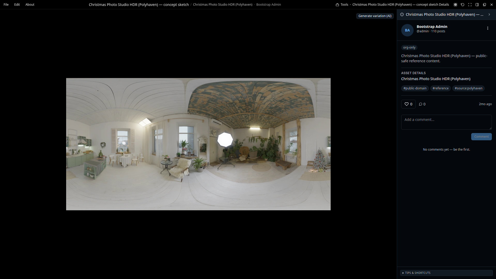
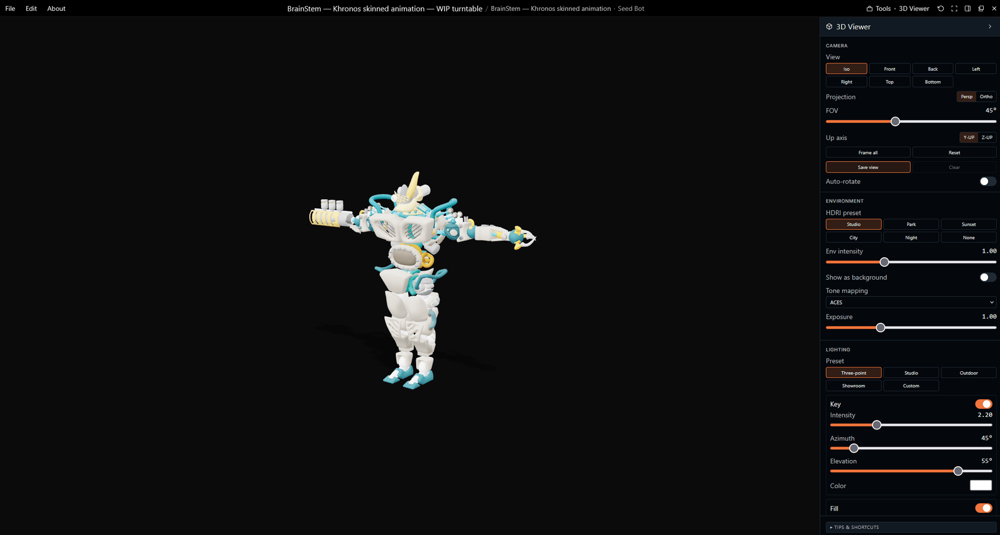
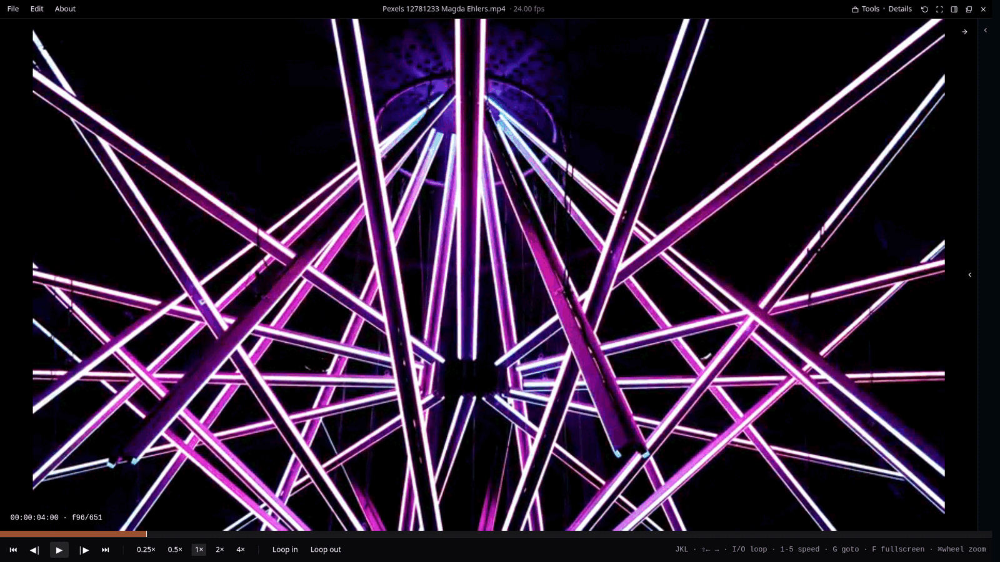
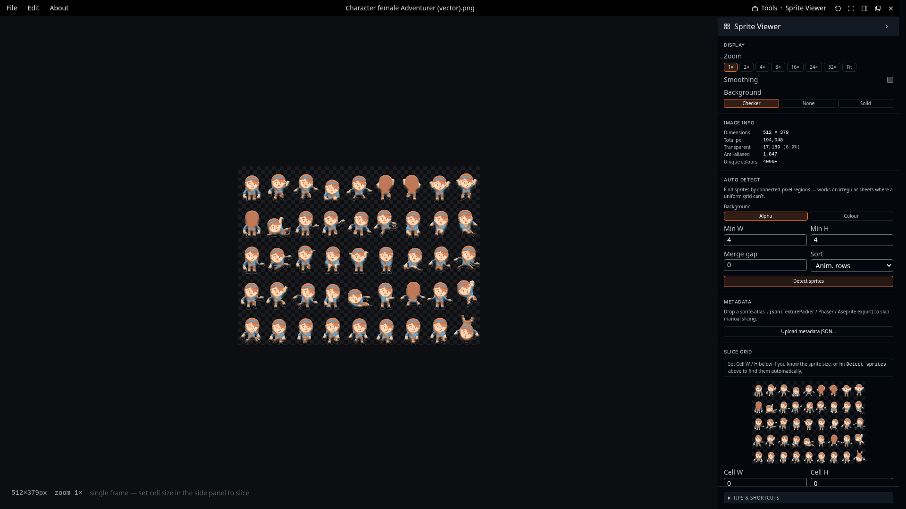
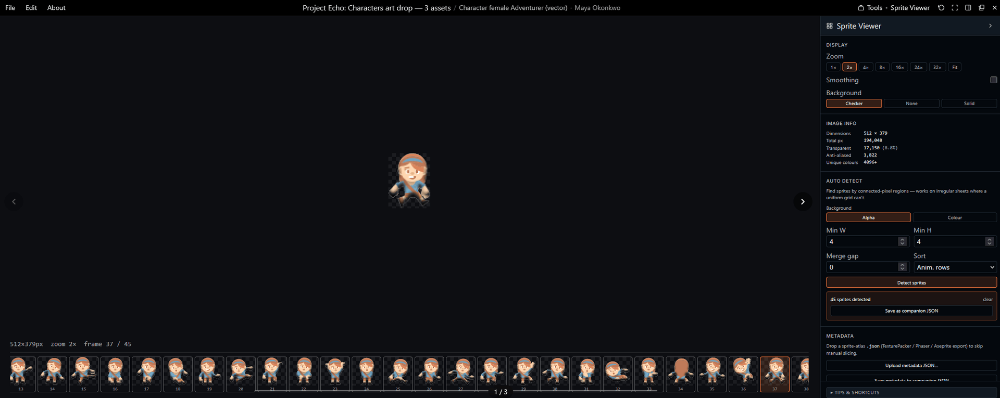
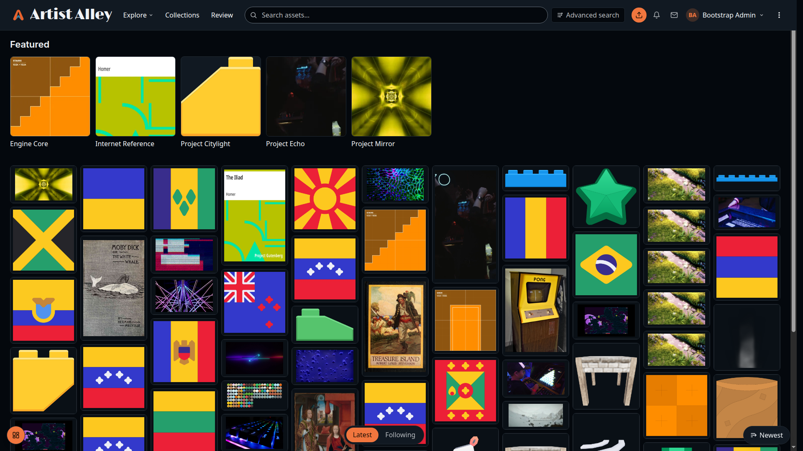
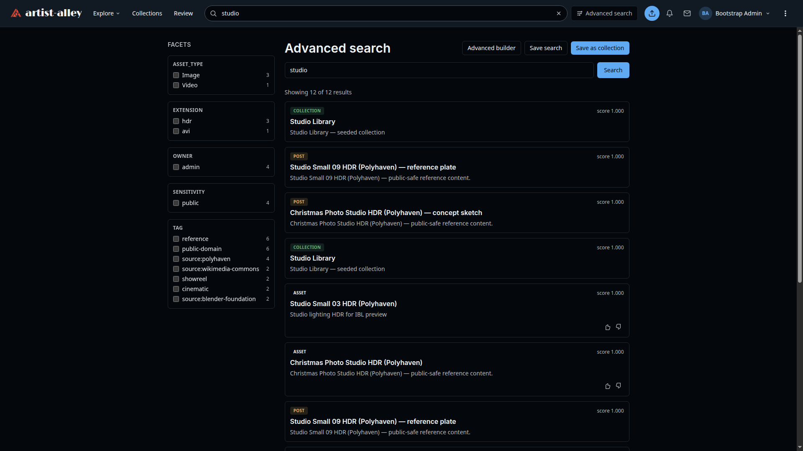
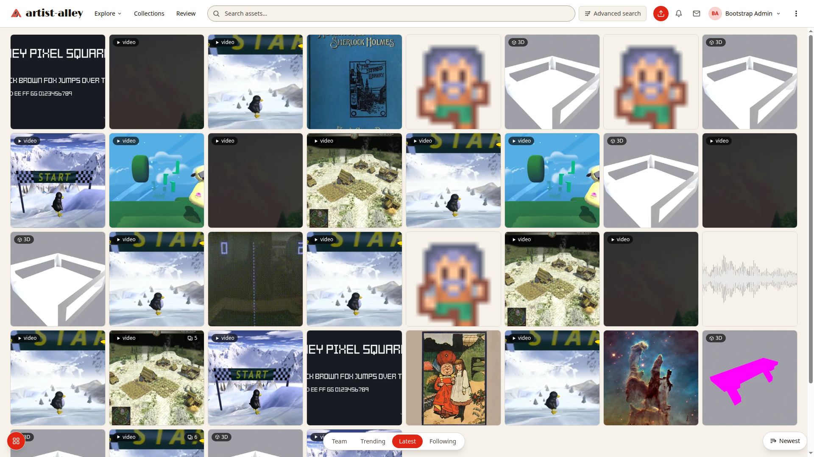
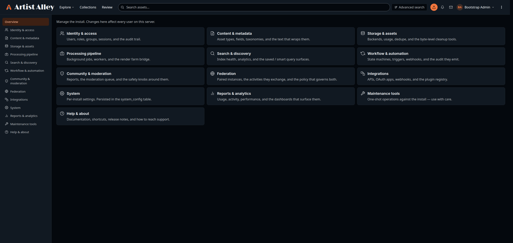

# artist-alley

[](app/go.mod)
[](LICENSE)
[](https://github.com/Artist-Alley-Org/artist-alley/releases)
[](https://artist-alley.org)

A self-hosted **art review and archival tool for game studios**. Artist-first UX, reviewer-grade workflow, single-binary deploy.

> **Status:** pre-1.0, active development. Releases are tagged and shipping (latest **v0.10.2**); the feature set is still landing. Not production-ready.

---

## Why this exists

Game studios review art and archive it across chat apps, whiteboards, and shared drives. Knowledge fragments across tools, review is inconsistent, and assets become hard to find a few years later. No good self-hosted tool fills the gap — and no DAM at all, open-source or commercial, federates between independently-operated instances. artist-alley is the first that does.

artist-alley is built around three pillars:

1. **Artist-first, not archive-first.** Artists upload-and-forget; metadata happens automatically wherever possible. The UX target is dead-simple — as easy as posting to a gallery, never filing into an archive.
2. **Review mode.** Async review works today — threaded comments on posts and assets, and annotations that respect who can see the work. The rest of the arc is what the next two releases build: a frame-accurate player, frame-scoped annotation, and live presenter sessions over SSE.
3. **Three-click rule.** Any common action reachable in three clicks or fewer.

Supporting all three: artist-alley implements [**ArchivePub**](docs/protocol/archivepub.md), an open federation protocol built on the ActivityPub data model with DAM-shaped extensions for asset sharing, workflow state, and brand workspaces. Studios share work with partners without paying SaaS rent; the protocol is open to any DAM that wants to implement it.

---

## Screenshots

Seeded with the public demo dataset ([ADR 0058](docs/adr/0058-demo-seed-dataset.md)).

The viewer is the app — posts, comments, metadata, and the asset playlist in
one surface.



| 3D viewer (live WebGL) | Frame-accurate video review |
|---|---|
|  |  |

| Sprite sheet viewer | Sprite auto-detection |
|---|---|
|  |  |

Browsing has a featured strip, a team rail, and five views of the same wall —
masonry, grid, thumbnail, list and feed. Each one is its own reading of the
work rather than the same tiles at a different size.



<details>
<summary>More surfaces</summary>

Search returns posts, artwork and collections together, with a facet rail
whose counts only ever reflect what you are allowed to open.





</details>

Demo content in screenshots is CC0 / CC-BY / CC-BY-SA and public-domain
source material; the aggregate set is CC-BY-SA 4.0 — per-source
attribution is in the dataset attribution list referenced in ADR 0058.

## Architecture

The target shape is intentionally small:

- **One Go binary** serves the JSON API and embeds the SvelteKit SPA via `go:embed`.
- **PostgreSQL** (with `pgvector`) holds everything — assets, metadata, embeddings, sessions, audit log.
- **nginx** in front for TLS termination and static serving.

Three production containers: `nginx`, `app`, `postgres`. No microservices, no message bus, no sidecars.

Storage is pluggable — filesystem by default, S3-compatible optional. Heavier capabilities (semantic image embeddings, audio transcription, document OCR, 3D-render thumbnails, local image-generation runtimes) ship as out-of-band **capability add-ons** that operators install separately — never baked into the binary. The plugin model for third-party extensions is WASM-based, deferred until external authors arrive.

ADRs in [`docs/adr/`](docs/adr/) are the source of truth for architectural decisions. Start with [ADR 0006](docs/adr/0006-go-as-target-backend.md) (architecture), [ADR 0008](docs/adr/0008-storage-architecture.md) (storage), [ADR 0017](docs/adr/0017-monetization-and-licensing.md) (licensing + enterprise gates), [ADR 0034](docs/adr/0034-capability-add-ons.md) (add-on layer), [ADR 0038](docs/adr/0038-premium-add-on-layer.md) (commercial model), and [ADR 0043](docs/adr/0043-federation-walled-garden-protocol.md) (federation — the ArchivePub reference spec lives at [`docs/protocol/archivepub.md`](docs/protocol/archivepub.md)).

---

## Tech stack

| Layer | Tech |
|---|---|
| Backend | Go 1.26, `pgx`, `sqlc`, OpenAPI 3 (oapi-codegen) |
| Frontend | SvelteKit (Svelte 5 runes), TypeScript, Vite |
| Database | PostgreSQL 16 + pgvector |
| Migrations | [goose](https://github.com/pressly/goose) |
| Storage | filesystem (default), S3-compatible (optional) |
| Search | Postgres `tsvector` (text), pgvector (semantic) |
| AI add-ons | local embedding / transcription / OCR runtimes, cloud AI-provider bridges — all opt-in |
| License | AGPL-3.0-only (dual-licensed — commercial license available, see [LICENSING.md](LICENSING.md)) |

---

## Quickstart

Requirements: Docker with Compose v2.

```bash
git clone git@github.com:Artist-Alley-Org/artist-alley.git
cd artist-alley
./scripts/bootstrap.sh
```

`bootstrap.sh` creates `.env` with random passwords, matches container UIDs to your host user, and brings the stack up.

```bash
docker compose up -d            # core stack (3D thumbnails included)
docker compose --profile storage-s3 up -d  # + MinIO for S3-backend testing
```

Open `http://localhost:8080` (or the port in your `.env`). Stop with `docker compose down`. Persistent data lives in named Docker volumes.

---

## Repository structure

```
artist-alley/
├── app/             # Go backend — the runtime
│   ├── cmd/         # binaries (server entrypoint)
│   ├── internal/    # per-domain handlers, db, storage, auth, …
│   ├── api/         # OpenAPI spec + generated server stubs
│   └── schema.sql   # Postgres schema (mirrors goose migrations)
├── web/             # SvelteKit frontend
├── infra/           # Dockerfiles, nginx config, postgres init
├── docs/            # doc source (ADRs, roadmap, install) — the public
│   │                #   site at artist-alley.org renders these at build
│   ├── adr/         # Architecture Decision Records (source of truth)
│   └── research/    # Investigation notes, not yet decisions
├── scripts/         # bootstrap, test, seed
├── docker-compose.yml
├── Dockerfile
├── LICENSE
├── CONTRIBUTING.md
└── RELEASING.md
```

---

## Roadmap

The full roadmap lives at [artist-alley.org/docs/roadmap](https://artist-alley.org/docs/roadmap/) and in [`docs/roadmap.md`](docs/roadmap.md). Every open issue is milestoned — see [**Milestones**](https://github.com/Artist-Alley-Org/artist-alley/milestones) for the release train.

- **Shipped (v0.1.0 – v0.8.0):** single-binary deploy, Postgres + pluggable storage, identity/auth with a full admin surface, upload pipeline, posts + collections, the universal asset viewer (image / video / audio / PDF / fonts / 3D / ebooks / comics / audiobooks / archives / docs / sprite sheets), federation over [ArchivePub](docs/protocol/archivepub.md), media derivatives, responsive UI, the operator surfaces (jobs admin, storage admin, storage integrity sweeps), and a public read surface — anonymous browsing behind an operator toggle that is off by default (single visibility enforcement point [ADR 0063](docs/adr/0063-content-visibility-predicate.md), sensitivity gates bytes not rows [ADR 0064](docs/adr/0064-sensitivity-gates-content-not-rows.md)). **v0.8.0** added the **operator & metadata configuration admin**: per-field vocabularies that grow from use (open-vocabulary keywords), a hierarchical tree-field editor, operator string overrides (site text), operator-authored email templates over a restricted context, rich-text field rendering, and collection metadata resolution.
- **v0.9.0 — permissions and the surfaces that were half-built.** Authorization became one rule per plane: a mutation capability confers the field plane but never the picture or the bytes, publication is delegable one transition at a time, and a capability nobody can hold fails CI. Deletion became reversible and visible — every account has a trash page with its recovery window, and a restoration appeal is decided by the deleter or a super-admin. The unfinished surfaces got finished: the asset edit page, a social feed card with its author, saving someone else's post to your collection, teams as a browsable directory with channels, and a page per field.
- **v0.10.0 / v0.10.1 / v0.10.2 — browse and search.** Every browse view has its own character: masonry strips down to pure art, thumbnail shows the work with the fields the operator marks for cards, list keeps a steady image column, and feed reads as a social view with descriptions and the first comments. Search is one system — type-ahead suggestions while you type, results only when you commit, kind chips and a facet rail whose counts reflect what you are allowed to open, and an advanced page where a typed condition builder and per-field metadata filters compose into a single query that lands in the address bar. A signed-in member's wall now shows every shared tier they can read. Mature content is a second axis throughout ([ADR 0090](docs/adr/0090-mature-content-is-a-second-axis.md)): artists mark it at upload, each account opts in, the instance has a master switch, and when you have not opted in the work is simply absent — from the feed, results, counts, suggestions and previews alike.
- **Next (v0.11.0 – v0.23.0):** the review & collaboration arc — a frame-accurate player with frame-scoped annotation, then shared sessions, the canvas and the inspectors — followed by articles and the 3D animation arc, community & moderation, sharing / bulk-ops, privacy / audit / observability, platform & extensibility (plugins / add-ons / MCP / imports), monetization & premium DCC, AI & creative tooling, the migration tool, physical archive mode, distribution & packaging, and federation phase 2 — sequenced so no milestone depends on a later one.
- **v1.0.0:** feature-complete. Everything currently on the roadmap and in the issue tracker targets GA; new work defaults there unless explicitly labelled `post-v1.0.0`.

---

## Contributing

Early days — please open an [issue](https://github.com/Artist-Alley-Org/artist-alley/issues) or [Discussion](https://github.com/Artist-Alley-Org/artist-alley/discussions) before starting non-trivial work. See [CONTRIBUTING.md](CONTRIBUTING.md) and the [developer docs](https://artist-alley.org/docs/developers/) — particularly [coding standards](https://artist-alley.org/docs/developers/coding-standards/) and [security](https://artist-alley.org/docs/developers/security/) — before opening a PR.

Architectural changes need an ADR per the convention in [ADR 0035](docs/adr/0035-adr-conventions.md). Reverse-engineering or interoperability work needs to follow the clean-room methodology in [ADR 0040](docs/adr/0040-clean-room-reverse-engineering-methodology.md).

---

## License

artist-alley is **dual-licensed**: **AGPL-3.0-only** for open-source use (see [LICENSE](LICENSE)) **or** a separate **commercial license** for use without the AGPL copyleft obligations — see [LICENSING.md](LICENSING.md). This is the license direction set in [ADR 0016](docs/adr/0016-license-direction.md); the monetization model is [ADR 0017](docs/adr/0017-monetization-and-licensing.md); premium add-ons under a separate EULA per [ADR 0038](docs/adr/0038-premium-add-on-layer.md).
