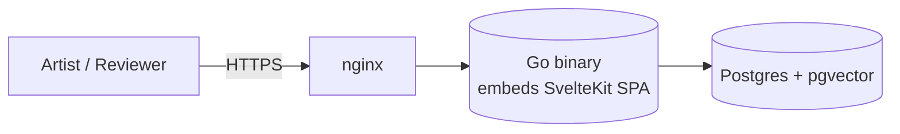

import { Card, CardGrid } from "@astrojs/starlight/components";

## Three pillars

<CardGrid stagger>
  <Card title="Artist-first" icon="pencil">
    Upload-and-forget. Metadata happens automatically where possible.
    UX target: ArtStation-level simplicity.
  </Card>
  <Card title="Review mode" icon="approve-check">
    Tracks unreviewed assets since your last session, remembers your spot,
    supports async commenting and live presenter sessions over SSE.
  </Card>
  <Card title="Three-click rule" icon="rocket">
    Any common action reachable in three clicks or fewer. Friction is
    the enemy of an archive that gets used.
  </Card>
</CardGrid>

## Architecture in one diagram

Three production containers, no microservices, no message bus, no sidecars.
See the [whitepaper](/whitepaper/) for the full design, or jump straight to
the [API reference](/api/reference/).

:::note[Pre-MVP]
Status: pre-MVP, active development. The architecture is settled; the
feature set is still landing. Not production-ready.
:::
