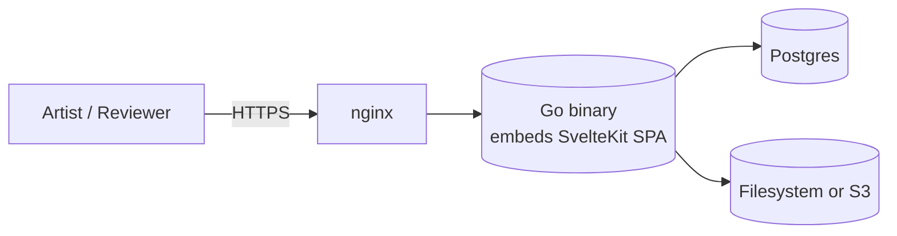

import { Card, CardGrid } from "@astrojs/starlight/components";

A full **production and archival system** for game and animation studios — concept, modelling, rigging, animation, cinematics, brand, finals — in one self-hostable binary. Replaces the Slack / Miro / Drive / Frame.io / WeTransfer stitch teams reach for when they don't have a dedicated asset tool.

The underlying model — assets, posts, collections, metadata, review, workflow — generalises further: any team cataloging items with associated media works just as well. Museums tracking artifacts with provenance scans, libraries digitising manuscripts, galleries managing loans, archives keeping document custody chains. The feature set is tuned for production studios first; the foundation is general.

**Open source. Free to self-host today.** The commercial path matures alongside the product.

## Two pillars

<CardGrid stagger>
  <Card title="Artist-first" icon="pencil">
    Upload-and-forget. Drag a folder onto the page, files queue and
    push in the background, metadata is inferred where possible.
    Posts wrap one or many assets; the cover thumbnail is yours to
    pick. Any common action — upload, find, comment, approve — reachable
    in three clicks or fewer. ArtStation-level simplicity for upload;
    friction is the enemy of an archive that gets used.
  </Card>
  <Card title="Review-grade" icon="approve-check">
    Per-post detail modal with inline comments, multi-asset
    scroll-through, dedicated review canvas with zoom / pan / tile,
    presentation rooms for live review sessions, animator-grade
    transport (JKL, frame-step, I/O loop), and workflow states the
    team controls — not the tool.
  </Card>
</CardGrid>

## End-to-end, in one binary

One binary. One database. One storage volume — or any S3-compatible bucket. No microservices, no message bus, no sidecars. Configure with environment variables, drop the binary on a host, point it at Postgres — done.

Heavier capabilities (CLIP embeddings, Whisper transcription, OCR, Blender-rendered thumbnails, image generation) ship as **optional add-ons** an operator installs separately — never baked into the binary. The core stays small and auditable in an afternoon.

## Ship channels

Artist Alley ships through every channel a self-hosted server can
land on. From any release tag (`vX.Y.Z`):

<CardGrid>
  <Card title="Docker" icon="seti:docker">
    `ghcr.io/mscrnt/artist-alley:latest` (mirrored to Docker Hub),
    multi-arch (amd64 + arm64), Sigstore-signed.
  </Card>
  <Card title="apt / dnf" icon="linux">
    `.deb` and `.rpm` packages with a hardened systemd unit and
    `/etc/artist-alley/aa.env` config template. Postinstall walks
    you through the next steps.
  </Card>
  <Card title="Static binary" icon="document">
    `linux/{amd64,arm64}`, `darwin/{amd64,arm64}`, `windows/amd64`
    on the GitHub Releases page with SHA256SUMS + SBOM.
  </Card>
  <Card title="Homebrew" icon="apple">
    `brew install mscrnt/tap/artist-alley` for macOS dev installs.
  </Card>
</CardGrid>

Full instructions: **[Installing Artist Alley](/guides/install/)**.

## Where to next

- **Operators** — [Install](/guides/install/) walks you through every channel; [For operators](/guides/for-operators/) covers Postgres, storage, backup, updates, and federation.
- **Artists** — [For artists](/guides/for-artists/) covers upload, posts, tags, and how versioning works.
- **Reviewers** — [For reviewers](/guides/for-reviewers/) covers the post detail modal, review canvas, comments, and presentation rooms.
- **Builders** — [Whitepaper](/whitepaper/) for design intent, [Architecture](/whitepaper/architecture/) for the codebase shape, [API reference](/api/reference/) for the wire, [Developers](/developers/) for contribution guidance.
