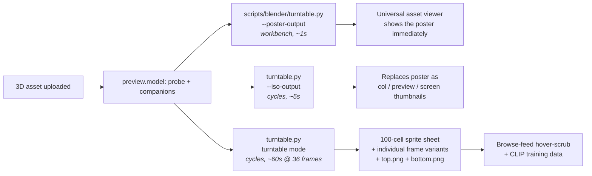

Artist Alley generates four distinct preview artifacts per 3D asset.
The work happens in a **Blender-headless worker container** orchestrated
by `app/internal/preview/model.go` on the Go side. This page documents
how the pipeline is wired so operators tuning their 3D throughput know
what every knob does.

This is what makes the in-modal 3D viewer (Phase 1.18.B-10, shipped)
have something to show before the heavy native viewer kicks in,
**and** is the source of the hover-scrub turntable in the browse feed.

## Overview



The pipeline shape is the same one called out in Phase 1.18.B-1
(Video pipeline — shipped) and Phase 1.18.B-11 (3D heavy converters)
on the roadmap. The 3D path runs in two engines:

| Pass         | Engine    | Samples | Time @ 512² | Purpose |
|--------------|-----------|---------|-------------|---------|
| Poster       | Workbench | n/a     | ~1s         | Immediate fallback thumbnail. Untextured FBX / OBJ render as magenta in workbench because it can't bind texture nodes — the iso pass overwrites this when textures matter. |
| Iso          | Cycles    | 32      | ~5s         | Single isometric (azimuth 45°, elevation 30°) replacement for col / preview / screen variants once textures are bound. |
| Turntable    | Cycles    | 32      | ~60s        | 36-frame orbital + top + bottom reference views. Frames feed the sprite-sheet + hover-scrub UI + CLIP training. |
| Top / bottom | Cycles    | 32      | ~10s        | Single shots above and below the model. Not part of scrub. |

## The Blender script

[`scripts/blender/turntable.py`](https://github.com/mscrnt/artist-alley/blob/main/scripts/blender/turntable.py)
is the single entry point for all three passes. The mode is selected
by which output flag is set; mutually exclusive.

### Invocation contract

```bash
blender --background --factory-startup --python turntable.py -- \
  --input  /tmp/asset.fbx        \
  --output /tmp/render           \
  --frames 36                    \
  --res    512                   \
  --engine cycles                \
  --samples 32
```

The `--` separator is required — Blender swallows everything before
it; the script's `argparse` only sees what follows.

### Modes

| Flag                | Mode      | Output                                            |
|---------------------|-----------|---------------------------------------------------|
| `--poster-output P` | Poster    | One workbench PNG at `P`. Script exits.           |
| `--iso-output P`    | Iso       | One Cycles isometric PNG at `P`. Script exits.    |
| (none of the above) | Turntable | `<--output>/turntable/frame_NNNN.png` × `--frames` + `<--output>/views/top.png` + `views/bottom.png` |

### Camera framing

The script uses an iterative-NDC fit rather than the naive
`distance = maxDim * 2.2` heuristic. The latter is wrong for any
non-cube model; the iterative approach handles tiny, huge, and
lop-sided geometry consistently:

1. Compute world-space bounding box across every mesh in the scene.
2. Derive an **initial distance** from the camera's actual FOV
   (`2 * atan(sensor_w / (2 * lens))`) and the bbox extents along the
   view direction at the current elevation.
3. **Iteratively check** that all 8 bbox corners project inside NDC.
   If any overflows, multiply distance by `1 + overflow + 0.1` and
   re-check. Five iterations max.

This handles tiny ASCII-art OBJs, fully-rigged FBX characters with
hat overhang, and Quake MDLs (which have asymmetric bboxes) without
manual tuning per asset.

### Camera pivot vs unparented orbit

Orbital frames use a **pivot pattern** — the camera is parented to an
empty at the bbox center; rotating the pivot's Z swings the camera
through the turntable arc. This avoids a class of Euler-rotation
edge cases that direct FOV math hits with extreme aspect ratios.

Top + bottom views unparent the camera transiently so it can sit
directly above / below the model along world Z.

### Lighting

A neutral 3-point area-light rig sized to the bbox radius:

| Light | Color           | Energy | Position (rel. to bbox center) |
|-------|-----------------|--------|--------------------------------|
| Key   | Warm `1.0 0.98 0.94` | 180    | `( 2.5, -1.5,  2.0)` |
| Fill  | Cool `0.75 0.85 1.0` | 60     | `(-2.5, -0.5,  0.5)` |
| Rim   | Neutral `1 1 1`      | 120    | `( 0.0,  2.0,  2.5)` |

Energy is `value × radius²` so small models don't blow out and large
models don't go flat.

A mid-grey world background (`0.35 0.35 0.38`) carries the bulk of the
illumination so meshes with no materials still read as 3D shapes
instead of disappearing in shadow.

Cycles uses the **AgX** view transform for highlight roll-off; Workbench
stays on **Standard** because the studio matcap already reads as neutral.

### Default material

Cycles renders empty material slots as the canonical magenta-pink
"missing shader" indicator. Untextured FBX / OBJ exports trip this
constantly. The script fills only the *gaps*:

- A `Principled BSDF` neutral grey material (`0.55 0.55 0.55`,
  roughness `0.55`, metallic `0`).
- Applied **only** to meshes whose material slots are empty or
  null. Existing artist materials are never stomped.

### Animation handling

When the imported scene contains object-level actions, mesh shape-key
actions, or armature object actions, the script:

1. Walks every action's `frame_range` (not `scene.frame_end` — the
   glTF importer doesn't always bump it).
2. Computes the global range `(min_start, max_end)` across all
   actions.
3. Advances the playhead by `range / frames` between turntable
   frames so the model rotates **and** animates through one full
   action cycle.

For static models, the playhead stays at `frame_start` for all
frames.

## Format coverage

Native importer dispatch by extension:

| Extension(s)                | Blender operator                                   |
|-----------------------------|----------------------------------------------------|
| `glb`, `gltf`               | `import_scene.gltf`                                |
| `fbx`                       | `import_scene.fbx`                                 |
| `obj`                       | `wm.obj_import` (4.x) → `import_scene.obj` (3.x)   |
| `dae`                       | `wm.collada_import`                                |
| `ply`                       | `wm.ply_import` → `import_mesh.ply`                |
| `stl`                       | `wm.stl_import` → `import_mesh.stl`                |
| `3ds`                       | `import_scene.max3ds` → `import_scene.autodesk_3ds`|
| `x3d`, `wrl`                | `import_scene.x3d`                                 |
| `usd`, `usda`, `usdc`, `usdz` | `wm.usd_import`                                  |
| `abc`                       | `wm.alembic_import`                                |
| `blend`                     | `wm.open_mainfile` + camera / light strip          |

The `_try_ops` fallback walks renamed-operator pairs so the same
script works against any Blender 3.x / 4.x image the worker container
might ship. Bump the Blender pin (currently 4.2 LTS, see Phase
1.18.B-11) without rewriting the script.

For formats Blender does **not** speak natively (MD2, MD3, MDL, MS3D
— old Quake / Half-Life lineage), the Go importer at
`app/internal/preview/format3d/` handles them via pure-Go decoders
that emit `.glb` to feed back into this same script. See Phase
1.18.C-2 + 1.18.C-3 commits for the writer + reader work.

## Configuration knobs

| Flag             | Default  | Notes |
|------------------|----------|-------|
| `--input`        | required | Path to source model |
| `--output`       | required for turntable mode | Directory root |
| `--frames`       | `36`     | Turntable frame count. 36 is the sweet spot for the 100-cell sprite sheet (`ceil(36² / 100) ≈ 13`-ish cells; pad to 100 for the chi route) |
| `--res`          | `512`    | Square render resolution |
| `--engine`       | `cycles` | `cycles` (PBR) or `workbench` (matcap, ~25× faster) |
| `--samples`      | `32`     | Cycles samples per frame. Below ~16 the denoiser starts to smear hair / fur |
| `--poster-output`| (off)    | Switch to single-shot workbench poster mode |
| `--poster-res`   | `384`    | Poster resolution |
| `--iso-output`   | (off)    | Switch to single-shot Cycles isometric mode |
| `--iso-res`      | `512`    | Iso resolution |
| `--iso-samples`  | `32`     | Iso Cycles samples |

## Container + ops

The worker pinned at **Blender 4.2 LTS** (Phase 1.18.B-11b, commit
`d4524f1`). Container UID is matched to the host so files written
into the bind-mounted asset storage have correct ownership without
chmod gymnastics — see `infra/docker/blender/` for the build.

Brought up via the optional compose profile so the three-container
production shape (nginx + app + postgres) stays the default:

```bash
docker compose --profile workers up -d
```

Cycles defaults to **CPU rendering** with OIDN denoising. The job
queue (Phase 1.18.A, shipped) bounds the worker concurrency via the
license-derived `uploadConcurrency` value (ADR 0017) so Community-tier
instances naturally cap render throughput.

## Companion-file handling

3D assets routinely carry companion files: `.mtl` next to `.obj`,
`.bin` next to `.gltf`, separately-uploaded textures. The Go side
(`app/internal/preview/model.go` + `companions.go`) stages every
companion into the Blender working directory before the script runs
so the operator-side import resolves textures and externals on disk
without operator config. See Phase 1.18.B-12c for the companion-
resolution work.

## When to bump samples

The default 32 samples is calibrated for OIDN denoising on small
mid-poly game assets. Bump if you're seeing:

- **Fireflies on metal / chrome** — bump `--samples` to 64.
- **Smeared hair / fur** — bump to 64 and consider lowering
  `max_bounces` (the script ships with `max_bounces=4` to limit
  glossy bounce cost; raise for accurate caustics).
- **Banding on smooth gradients** — view transform issue, not
  samples. Stay on AgX (the default).

## Roadmap context

- **Phase 1.18.B-10** (shipped) — Native 3D viewer in the browse +
  post-detail modal.
- **Phase 1.18.B-11** (in flight) — 3D heavy converters: Blender
  headless → glTF for `.blend`, FBX2glTF (pending), Maya / Max
  side-cars (pending).
- **Phase 1.36** (planned) — PBR 3D viewer polish: live material
  inspector, IBL environment picker, A/B material wipe. Builds on
  the same imported-into-three.js scene this script renders.
