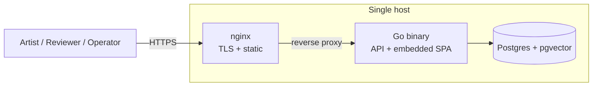

The target shape is intentionally small.

## Production topology

- **Go binary** serves the JSON API and embeds the SvelteKit SPA via
  `go:embed`. One artifact. One process.
- **Postgres** (with `pgvector`) holds everything — assets, metadata,
  embeddings, sessions, audit log.
- **nginx** in front for TLS termination and static serving.

Three production containers, full stop. No microservices, no message bus,
no sidecars.

## Contract-first API

The JSON API is defined in
[`app/api/openapi.yaml`](https://github.com/mscrnt/artist-alley/blob/main/app/api/openapi.yaml).
That file is the **contract**: server types and handler interfaces are
generated from it by `oapi-codegen`. Frontend code (SvelteKit) generates
its TypeScript types from the same source.

Edits to the spec are the only way to change the public API surface —
handlers will fail to compile if the Go signatures drift from the spec.

The rendered reference lives at [API reference](/api/reference/) and is
re-rendered on every push.

## Schema

The Postgres schema is declared in
[`app/schema.sql`](https://github.com/mscrnt/artist-alley/blob/main/app/schema.sql)
and surfaced here at [Database schema](/reference/schema/). The schema is
the source of truth — `sqlc` type-checks Go queries against it at build
time, so type drift gets caught before code ships.

## Why these choices

- **Go for the server** — single static binary, fast cold start, strong
  concurrency story, native HTTP/2 + SSE for the live presenter flow.
- **SvelteKit for the SPA** — small bundle, fast hydration, file-based
  routing that maps cleanly to the API shape.
- **Postgres + pgvector** — boring durable database; pgvector keeps
  embeddings in the same place as the records they describe, so search
  is a single SQL query, not a separate vector store.
- **`go:embed` for the SPA** — operators don't need to think about
  static asset deployment. The binary is the whole frontend.
