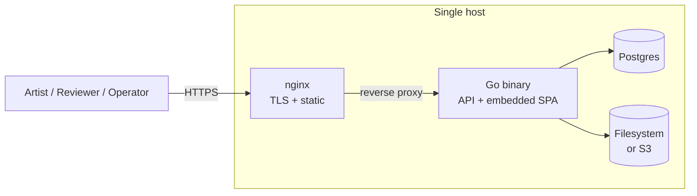

The target shape is intentionally small.

## Production topology

- **Go binary** serves the JSON API and embeds the SvelteKit SPA via
  `go:embed`. One artifact. One process. Same binary supports the
  `embed_web` build tag for production (frontend baked in) and a
  dev mode that proxies the Vite dev server.
- **Postgres** holds every record artist-alley owns — assets,
  metadata fields + values, posts, members, collections, comments,
  likes, sessions, audit, system_config. Migrations live in
  `app/internal/db/migrations/` and run on boot.
- **Storage** is content-addressed: every byte blob is keyed by its
  SHA-256, so dedupe across the install is free. Two backends:
  - **`fs`** — directory on the host (mounted into the container)
  - **`s3`** — any S3-compatible API (AWS, R2, B2, MinIO)
- **nginx** in front for TLS termination and static serving.
  Optional: the binary serves HTTP fine on its own behind another
  proxy if you prefer.

## Contract-first API

The JSON API is defined in
[`app/api/openapi.yaml`](https://github.com/mscrnt/artist-alley/blob/main/app/api/openapi.yaml).
That file is the **contract**: server types and handler interfaces
are generated from it by `oapi-codegen`. Frontend code (SvelteKit)
generates its TypeScript types from the same source via
`openapi-typescript`.

Edits to the spec are the only way to change the public API surface
— handlers won't compile if the Go signatures drift from the spec,
and `npm run check` fails on the frontend if its generated types
diverge.

The rendered reference lives at [API reference](/api/reference/) and
is re-rendered on every site build.

## Schema

The Postgres schema is declared in
[`app/internal/db/migrations/*.sql`](https://github.com/mscrnt/artist-alley/tree/main/app/internal/db/migrations)
and surfaced here at [Database schema](/reference/schema/). Migrations
are the source of truth — `sqlc` type-checks Go queries against
them at code-generation time, so type drift gets caught before code
ships.

We don't ship a `schema.sql` snapshot file because migrations are
forward-only — replaying them in order from a fresh database is the
canonical way to get the current schema.

## Configuration & system_config

Two layers:

- **Process config** (host vs container, ports, secrets) — driven by
  environment variables, see the
  [install guide configuration reference](/guides/install/#configuration-reference).
- **Install-wide settings** (site name, SMTP, auth providers, AI
  providers, brand fonts, themes) — stored as JSON-typed rows in the
  `system_config` table, mutated through the admin UI, surfaced via
  the `/admin/system/*` API. The `appearance` key drives the
  per-install font slot picker.

Federation-aware: every `system_config` row stays local to its
instance. Per-user prefs (theme, language, AI provider override)
ride on `user_profiles` which carries `origin_server_id`.

## Why these choices

- **Go for the server** — single static binary, fast cold start,
  strong concurrency story, native HTTP/2 + SSE for the live
  presenter flow.
- **SvelteKit for the SPA** — small bundle, fast hydration,
  file-based routing that maps cleanly to the API shape. Build
  output is static (`adapter-static`) so the binary just serves
  files.
- **Postgres-only** — boring durable database; one place to back up,
  one query language across every entity in the system. No
  separate cache, no vector store, no search index. The full-text
  search vector lives as a TSVECTOR column with a trigger that
  rebuilds it on writes.
- **`go:embed` for the SPA** — operators don't need to think about
  static asset deployment. The binary is the whole frontend.
- **Content-addressed storage** — uploading the same bytes twice
  stores them once. Move the install to a new disk by `rsync`-ing
  the storage directory; integrity is recoverable by re-hashing.

For the rationale behind each big call see
[Architecture Decisions](/adr/).
